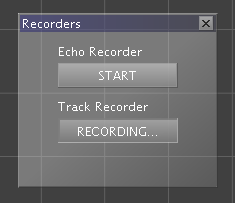

# SystemFailed ML Tool

## TUIO
`./tuio_demo.py` demonstrates how to receive events from the [TUIO](https://www.tuio.org/) protocol with python.

**Installation**:
```bash
python -m venv venv
source ./venv/bin/activate
pip3 install -r requirements.txt
```

**Usage**:
```bash
./tuio_demo.py
```

**Demo output**:
```
detect a new Cursor
1627563372671|0|0.3504999279975891|0.761180579662323
detect a new Cursor
1627563372671|2|0.3353624641895294|0.7373881340026855
detect a new Cursor
1627563372671|4|0.3524552583694458|0.5483244061470032
detect a new Cursor
1627563372671|6|0.34697335958480835|0.5067898631095886
detect a new Cursor
1627563372671|8|0.4433818757534027|0.6227743625640869
detect a new Cursor
1627563372671|11|0.5009947419166565|0.8925699591636658
Bundle recived with /tuio/2Dcur:fseq [0]
Bundle recived with /tuio/2Dobj:fseq [1]
1627563372687|0|0.350525826215744|0.7614848017692566
1627563372688|2|0.33516111969947815|0.7374130487442017
1627563372688|4|0.3525283634662628|0.5482931137084961
1627563372688|6|0.34695497155189514|0.5067517161369324
1627563372688|8|0.44360458850860596|0.6230084896087646
1627563372688|11|0.5007518529891968|0.8925452828407288
Bundle recived with /tuio/2Dcur:fseq [1]
Bundle recived with /tuio/2Dobj:fseq [2]
1627563372704|0|0.35050132870674133|0.761777937412262
1627563372704|2|0.334982305765152|0.7374348044395447
1627563372704|4|0.352561354637146|0.5483412742614746
1627563372704|6|0.3469679057598114|0.5067083239555359
1627563372704|8|0.44382667541503906|0.6229809522628784
1627563372704|11|0.5002220273017883|0.8927435874938965
Bundle recived with /tuio/2Dcur:fseq [2]
Bundle recived with /tuio/2Dobj:fseq [3]
1627563372721|0|0.3502969741821289|0.7616165280342102
1627563372721|2|0.33509066700935364|0.7368723750114441
1627563372721|4|0.3525628447532654|0.5484094023704529
1627563372721|6|0.3469584882259369|0.5066850781440735
1627563372721|8|0.44417089223861694|0.6227718591690063
1627563372721|11|0.49972379207611084|0.8929316997528076
```

The output printed on `stdout` is (as discussed) a 4-tuple, separated by a `|` (ascii: 124), with the following fields:
1. timestamp in millis
2. session id
3. x (in meters)
4. y (in meters)

The client listens on `127.0.0.1:3333` for incoming UDP packets.
You have to update the following line to listen on other interfaces / bind to another IP address or port:
```python
client = TuioClient(("localhost",3333))
```


## Training Data
### ndjson file format
> It is unclear, what the scene id in the training data means.
> The provided script chunks the track data for a given pedestrian into scenes, so that each scene has the same length, which turned out to be a requirement by the machine learning algorithm.

First, you need to record tracks using the *Track Recorder*, that creates `*.trk` files in the `pharus`' working directory.


**Usage**:
```bash
./pharus_to_ndjson.py input.trk > output.ndjson
```

### trajnetpluplus external data set format
This is the format used in some external datasets like [this](https://github.com/vita-epfl/trajnetplusplusdataset/blob/master/data/trajnet_original/crowds/arxiepiskopi1.txt) or [this](https://github.com/vita-epfl/trajnetplusplusdataset/blob/master/data/trajnet_original/biwi/biwi_hotel.txt)

To convert to this format you can use the following command:
```bash
tr '|' ' ' < input.trk > output.txt
```

'Frame' numbers in the provided existing datasets are non continous, just like the timestamps in the `pharus` recordings.
If continous frame numbers are required instead of timestamps, define the following shell function:

```bash
function convert() {
	FRAME=-1
	PREVIOUS=''
	while IFS= read -r line; do
		TS=$(echo $line | cut -d '|' -f 1)
		P=$(echo $line | cut -d '|' -f 2)
		X=$(echo $line | cut -d '|' -f 3)
		Y=$(echo $line | cut -d '|' -f 4)
		if [ "$PREVIOUS" -ne "$TS" ]; then
			FRAME=$((FRAME+1))
		fi
		echo "$FRAME $P $X $Y"
	done < "$1"
}
```

And use it for your recordings:
```bash
convert ./input.trk | tee output.txt
```
